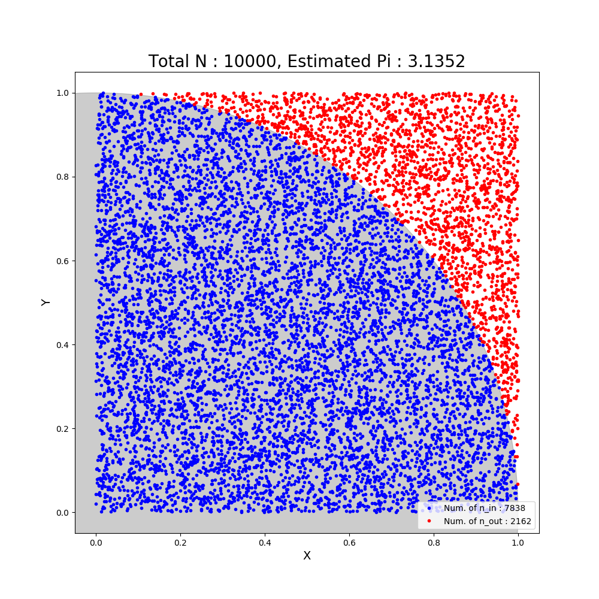

# homework3 on Numerical Analysis using PyThon
homework3 on Numerical Analysis using PyThon

* Global Temperature
* Carbon Dioxide
* Estimate \\(\pi\\) Number By using the Monte-Carlo Integration

## Requirements

```
sudo pip3 install requirements.txt
```
## Usage
* Global Temperature
```
python3 global_warming.py
./global_warming.py
```

* Carbon Dioxide
```
python3 co2_mm_mlo.py
./co2_mm_mlo.py
```

* Estimate \\(\pi\\) Number By using the Monte-Carlo Integration
```
python3 pi_estimate.py
./pi_estimate.py
```

